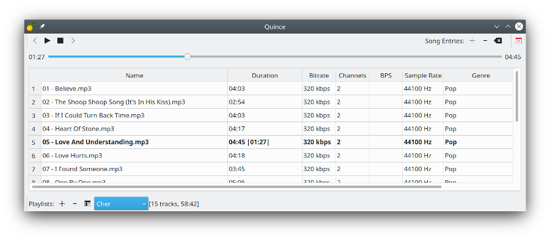

# Quince audio player 
A foobar2000-like audio player for the Linux desktop written in C++/Qt5.

#### Features:
 - [x] Quick startup & only play local song files
 - [x] Remembers the last playing playlist, song and its position and
 by default resumes playing from there.
 - [x] No filesystem scanning, files are added to playlists by drag and drop (DnD).
 - [x] No audio streaming services, visuals/equalizers, embedded wikipedia or whatnot.
 
#### Audio files support:
 - [x] Mp3
 - [x] Opus
 - [x] Flac
 - [ ] Webm
 - [ ] ogg
 - [ ] m4a
 - [ ] mka
 
#### How to build:
Install dependencies from Terminal:
```
sudo apt-get install cmake qt5-default libgstreamer1.0-dev libgstreamer-plugins-base1.0-dev libflac++-dev libopusfile-dev libkf5globalaccel-dev libglib2.0-dev g++ git gstreamer1.0-plugins-good gstreamer1.0-plugins-bad
```
Now cd to the Quince source code and build it:
```
- mkdir build && cd build
- cmake ..
- make -j4
- run the app: ./quince
```

#### Supported Desktops:
 - [x] KDE Plasma 5
 - [ ] Gnome 3
 
#### Screenshot:

